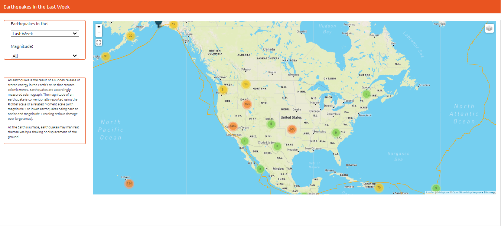
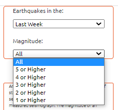

# Map

## Overview

The United States Geological Survey (USGS) is responsible for providing scientific data about natural hazards, the health of our ecosystems and environment; and the impacts of climate and land-use change. Their scientists develop new methods and tools to supply timely, relevant, and useful information about the Earth and its processes. 
Using this dataset, I mapped the tectonic plaques and earthquakes in most parts of the world. 

  

## Map

To create the map I used Leaflet and ploted all of the earthquakes from ther data set based on their longitude and latitude. The data markers reflect the magnitude of the earthquake in their size and color. Earthquakes with higher magnitudes should appear larger and darker in color. I also included popups that provide additional information about the earthquake when a marker is clicked.
Different number of base maps were added to choose from as well as separate out our two different data sets into overlays that can be turned on and off independently.

Also, using JavaScript I was able to create some filter for different time periods ad also for different magnitudes 

  

